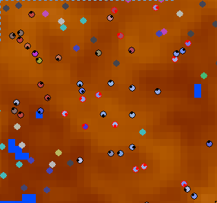

## Donut Simulator

Welcome to *Donut Simulator*, the program that completely fails to live up to its name.

#### If it doesn't simulate donuts, then what does it do?

This is a population simulator! It creates a bunch of circles which can observe their environment, move around, eat, and reproduce, and simulates them living in an environment with randomly-generated "trees" which they can eat. Successful ones live to reproduce and have children, and eventually become the masters of the technicolor forest. It's loads of fun (and loads of processor-melting floating-point operations!) To use the terms of art, it's pretty much a genetic algorithm for neural networks.

#### Why is it called Donut Simulator?

The world that these organisms inhabit wraps at the edges. This means that their world is shaped like a *toroid*, aka approximately a donut.

#### What do I need to experience this simulationy goodness?

You'll need **Python 3**, as well as the **pygame** library. I think that's it?

#### Is it finished?

No!!

## Screenshots

*In the beginning, the trees are winning. But their lead isn't safe for long...*

*Here, a species calling themselves 'Uteu' have appeared and learned that trees taste good.*

*Sometimes multiple species find each other and have to compete for resources. Exciting!*

*Creatures who are especially good at tree-eating pull ahead of the rest.*

*The creatures make a big dent in the tree population, but that kind of growth isn't sustainable.*

Sometimes, a species will learn to live in harmony with nature, and survive the boom-and-bust cycle. I recommend leaving this running for a long time and then coming back to it later if you want to see more interesting stuff happen.
